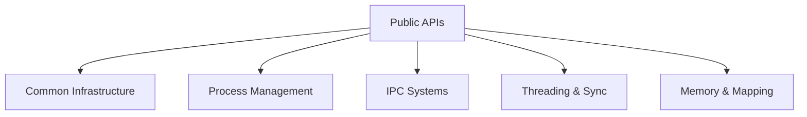

# SysCore Architecture Guide

SysCore is structured into modular layers designed for portability, robustness, and performance.

## Subsystems

1. **Common Infrastructure**: Error propagation macros (`syscore_error_t`), compiler identification, logging levels.
2. **Process Management**: Native process orchestration (fork, execute, wait tracking).
3. **IPC Systems**: Synchronous and asynchronous transport via pipes, named FIFOs, and emulated POSIX message queues.
4. **Threading & Sync**: Execution isolation (POSIX threads, mutexes, condition variables, and read-write locks).
5. **Memory & Mapping**: Shared memory segment mappings and granular page protection boundaries.
